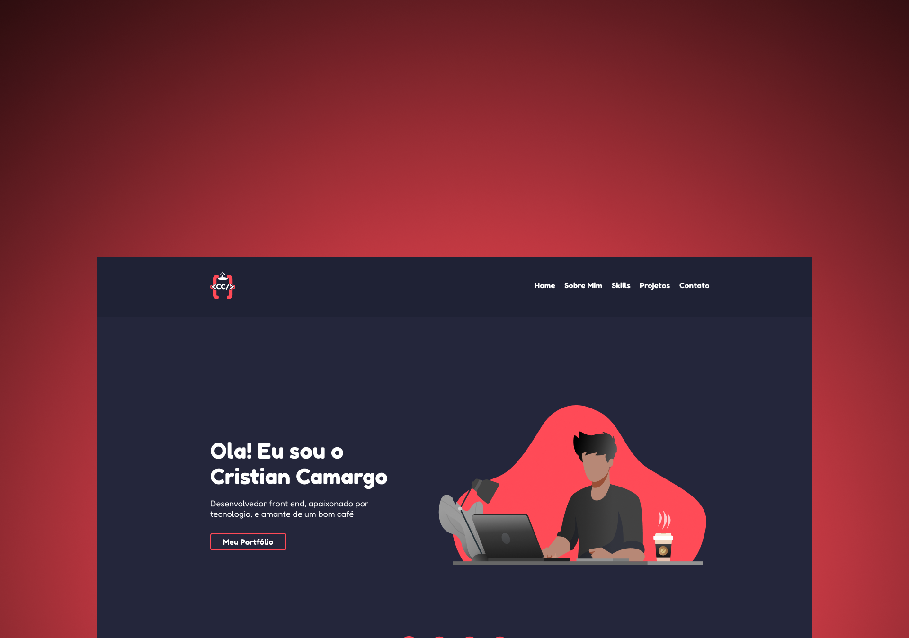

# Meu Portfólio

## Experiência e Tecnologias

- Esse é meu primeiro projeto profissional utilizando React, e foi de muito aprendizado pra mim.
- Além da utilização de react, pude adicionar tipagem com o Typescript e ainda usar Styled Components.
- O Projeto conta também com formulario que envia os dados pra email utilizando o EmailJS.
- O projeto foi projetado com responsividade para varios tamanhos de tela.
- No projeto também utilizei bibliotecas react como react-skillsbar e react-toastify

### Tecnologias Utilizadas
- HTML
- CSS
- JavaScript
- Typescript
- Styled Components
- GitHub
- Sass

### Bibliotecas e Utilitários
- Email JS | https://www.emailjs.com/
- React SkillsBar | https://www.npmjs.com/package/react-skillbars
- React Toastify | https://fkhadra.github.io/react-toastify/introduction/

## Design

- Todo o design foi projetado por mim, onde pude mesclar cores que gostei, e meus conhecimentos em design
- O projeto foi desenhado no Figma, criando um protótipo antes de iniciar o Código

- Link do Layout : https://www.figma.com/file/mulUsoSH1eydftKI7aKPx7/Cristian-Camargo-Portfoly?node-id=0%3A1

## O Projeto

- O projeto esta online e pode ser acessado atraves deste link: https://camargodev.com.br
- O projeto foi hospedado usando os servidores da Hostinger.
- O Projeto recebe atualizações constantes, para melhorias que estou implementando.
- Nesse projeto enfrentei muitos problemas como bugs na responsividade usando o navegador Safari, problemas para usar a skillsbars, além de precisar aprender a lidar com as bibliotecas externas que foram utilizadas.

